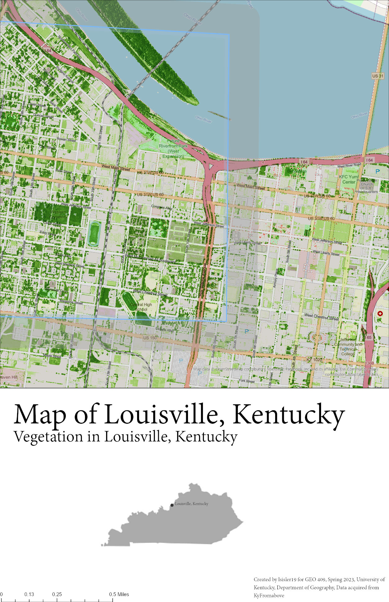

# louisville-kentucky

# Map of Louisville, Kentucky
# Louisville is the largest city in Kentucky. It is in Jefferson County and is located on the other side of the Ohio River.

Louisville, Kentucky 
     
Shaded relief of above-ground features and vegetation.

[Link to high-resolution version](louisville.pdf)     

Created by lsisler19 for GEO 409, Spring 2023, University of Kentucky, Department of Geography, Data acquired from KyFromabove
